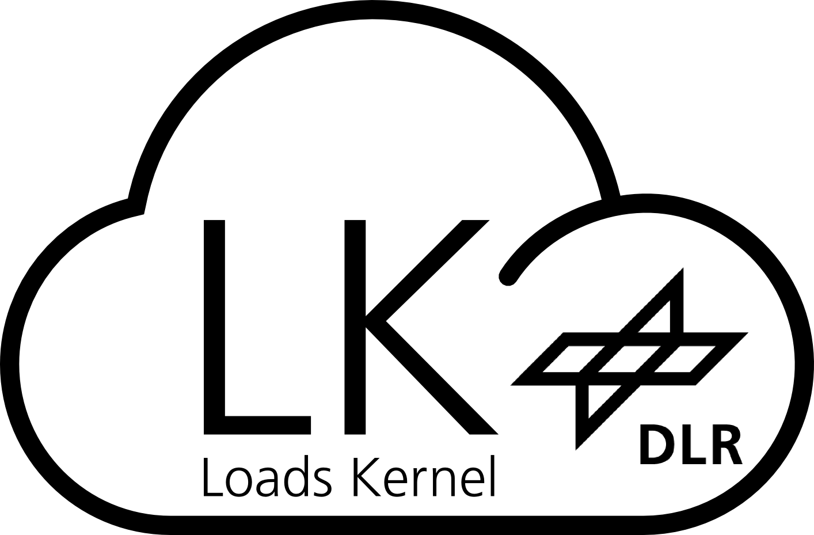

# Loads Kernel

<p align="left">

</p>

The Loads Kernel Software allows for the calculation of quasi-steady and dynamic maneuver loads, unsteady gust loads in the time and frequency domain as well as dynamic landing loads based on a generic landing gear module.

[](https://zenodo.org/badge/latestdoi/537500844)

# Theorectical Background & References

[1] Voß, A., “Loads Kernel User Guide, Version 1.01,” Institut für Aeroelastik, Deutsches Zentrum für Luft- und Raumfahrt, Göttingen, Germany, Technical Report DLR-IB-AE-GO-2020-136, Nov. 2021, https://elib.dlr.de/140268/.

[2] Voß, A., “An Implementation of the Vortex Lattice and the Doublet Lattice Method,” Institut für Aeroelastik, Deutsches Zentrum für Luft- und Raumfahrt, Göttingen, Germany, Technical Report DLR-IB-AE-GO-2020-137, Oktober 2020, https://elib.dlr.de/136536/.

If you use this software for your scientific work, we kindly ask you to include a reference [1,2] in your publications. Thank you!

# Installation & Use
## Basic Installation 
Install Loads Kernel as a python package with core dependencies via:

```
pip install LoadsKernel
```

## How can I use it?

Copy and adjust the launch script (launch.py, example located in the [scripts folder](https://github.com/DLR-AE/LoadsKernel/tree/master/scripts)) to your needs / for your aircraft configuration. Then, launch the python script with:

```
python launch.py
```

Alternatively, if ~/.local/bin is in your system PATH, you can use the following commands from the command line:

```
loads-kernel --job_name jcl_xy --pre True --main True --post True --path_input /path/to/JCLs --path_output /path/to/output
```

## Advanced Installation 

As above, but with access to the code (keep the code where it is so that you can explore and modify):

```
git clone https://github.com/DLR-AE/LoadsKernel.git
cd <local_repo_path>
pip install -e . 
```

To use the graphical tools and other features, optional libraries definded as extras are necessary:

```
pip install -e .[extras]
```

Note: Especially with mpi or the graphical libraries, pip frequently fails. In that case, try to install the failing packages using a
package manager such as conda.

There are two GUIs to visualize a simulation model (the Model Viewer) and to compare different sets of loads (Loads Compare), which can be started from the command line as well.

```
model-viewer
loads-compare
```

# License
This software is developed for scientific applications and is delivered as open source without any liability (BSD 3-Clause, please see [LICENSE](LICENSE) for details). For every new aircraft, a validation against test data and/or other simulation tools is highly recommended and in the responsibility of the user. 

If you use this software for your scientific work, we kindly ask you to include a reference [1,2] in your publications. Thank you!

# Feedback & Support
Note that this is a scientific software for users with a background in aerospace engineering and with a good understanding and experience in aeroelasticity. If you know what you are doing - go ahead and have fun! If you need specific help or assistence, we offer commerical support:
- Development of additional, proprietary features
- Consulting & Training courses
- Service & Support

We are interested in partnerships from both industry and academia, so feel free to contact us (arne.voss@dlr.de).

If you discoverd an obvious bug, please open an [issue](https://github.com/DLR-AE/LoadsKernel/issues). In case you already know how to fix it, please provide your feedback via merge requests. For details, please see the [instructions](CONTRIBUTING.md) on how to provide a contribution or contact arne.voss@dlr.de if you need any assistance with that.

# Continuous Integration
Status of the continuous integration pipelines / workflows:

Master branch 

[](https://github.com/DLR-AE/LoadsKernel/actions/workflows/regression-tests.yml)
[](https://github.com/DLR-AE/LoadsKernel/actions/workflows/coding-style.yml)

Development branch 

[](https://github.com/DLR-AE/LoadsKernel/actions/workflows/regression-tests.yml)
[](https://github.com/DLR-AE/LoadsKernel/actions/workflows/coding-style.yml)

# Internal Part (DLR)

## Examples
There are a number of typical examples, which cover different analyses and simulations. The examples are stored in an additional (internal) DLR GitLab repository:

```
git clone https://gitlab.dlr.de/loads-kernel/loads-kernel-examples.git
```

## Tutorials
In the ./doc folder, there are is a growing number of tutorials based on Jupyter notebooks. You can either have a look at the [static html tutorials](https://loads-kernel.pages.gitlab.dlr.de/loads-kernel/tutorials/) or use the Jupyter notebooks interactively. Start the jupyter notebook server, which will open a dashborad in your web browser. Then navigate to the ./doc/tutorials, open one of the *.ipynb notebooks and you can walk through the tutorials step-by-step.

```
jupyter notebook
```

## Continuous Integration
In addition to the public regression testing (see above), additional and more comprehensive tests are performed and compared against long standing reference results. This is an internal process and the status of the continuous integration pipelines can only be accessed from within DLR:

Master branch [](https://gitlab.dlr.de/loads-kernel/loads-kernel/-/commits/master)

Development branch [](https://gitlab.dlr.de/loads-kernel/loads-kernel/-/commits/devel)

Test coverage [](https://loads-kernel.pages.gitlab.dlr.de/loads-kernel/coverage/)
