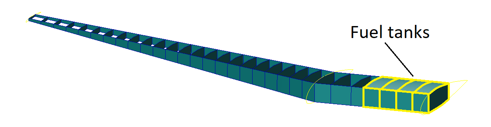
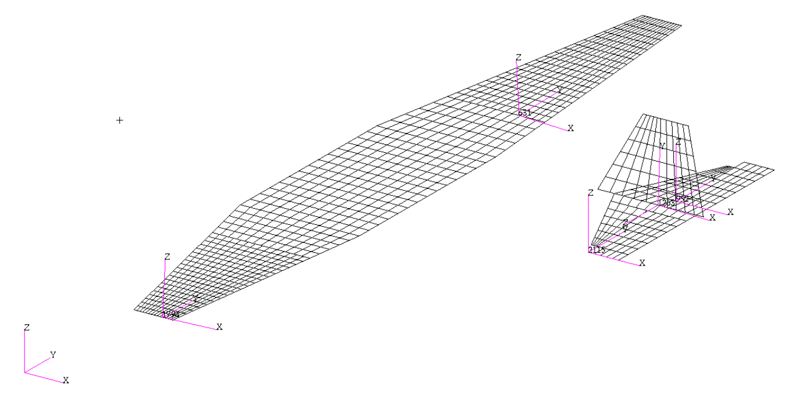

# Aeroelastic Model of the DC3

In this Jupyter notebook the aeroelastic modelling of the Douglas DC-3 is going to be exposed and explained. This model will include the finite element model, aerodynamic model, mass model, and fuel model. Additionally, the different mass configurations and various modified models will be detailed. The model was created with the aim of getting as close as possible to reality. Nonetheless, the model needs to fullfill some requirements, that are descriminated in front, and that is why modified models of the original models were created. Finally, the eigenmodes of the final modified model will be analysed. The aim of exposing the aeroelastic model is to show the different parts that the model should include and the level of detail. In the following figure, the aircraft in question can be seen:

*A DC-3 operated by Scandinavian Airlines.*

To ensure the generality, requisite complexity, and representativeness of the developed aeroelastic model, a deliberate choice was made regarding the optimal aircraft. To comprehend the rationale behind this selection, it is imperative to first grasp the specific requirements that the chosen aircraft needed to fulfill. The decision was made to start with an existing aircraft and, if needed, introduce modifications to accentuate certain aeroelastic phenomena. The specific requirements and specifications targeted were:

- <strong>Aircraft Configuration</strong> - Simple and conventional.
- <strong>Wing</strong> - Features a simple planform (non-rectangular), with a significant leading edge (LE) sweep angle (&Lambda;LE), washin/washout angle (&Phi;), dihedral angle (&Gamma;), and an airfoil with camber. The aspect ratio (AR) should exceed 8 to facilitate the application of beam theory.
- <strong>Empennage</strong> - Adheres to a conventional configuration or includes a T-tail.
- <strong>Control Surfaces</strong> - Includes ailerons, elevators, and a rudder. Flaps, though optional, are excluded from the model.
- <strong>Engines</strong> - Limited to a maximum of 2 engines.
- <strong>Subsonic Regime</strong> - Mach number is below 0.6 (M&lt;0.6) to avoid the formation of shock waves.
- <strong>Representativeness</strong> - The aircraft must be easily recognizable, as well as representative; for instance, a glider is not deemed suitable.
- <strong>Information Availability</strong> - Extensive data about the aircraft must be publicly accessible. This encompasses general geometry dimensions, airfoil data, internal structure, center of gravity (Cg), mass distribution, flight envelope, and performance.
- <strong>Aeroelastic Effects:</strong> - The aircraft should exhibit notable wing bending and torsion during level flight, with an evident flutter mechanism where bending and torsion modes are coupled. It is noteworthy that the properties of the aircraft can be manipulated to accentuate these aeroelastic phenomena.

  
## Modelling Overview

Before starting with the more detailed model description, a modelling overview will be provided. This overview aims to explain better the purpose of the aeroelastic modelling. It is important that before using <em>Loads Kernel</em> some steps need to be performed before hand. Firstly, the aeroelastic model must be done by hand (using <em>Patran</em>), or a third party program (such as the in-house DLR tool <em>Modgen</em> {cite}`modgen2023`). Secondly, <em>MSC Nastran</em> is used to the role of a pre-processor that only delivers mass and stiffness matrices. After exporting the mass and stiffness matrices from <em>MSC Nastran</em> to <em>Loads Kernel</em>, <em>Loads Kernel</em> reads the finite element grid points and aeromodel as <em>MSC Nastran</em> cards.

## Finite Element Model

To construct the finite element model for the Douglas DC-3, <em>ModGen</em> was employed, an in-house tool developed by DLR. <em>ModGen</em> was used to establish the finite element model of the wing-like components: the right and left wings, right and left horizontal tails, and the vertical tail. For that, the following steps were followed:

- <strong>Planform definition</strong> - not only the general parameters of the wing and empenage, but the dihedral angle, incidence angle and control surfaces (ailerons, elevators and rudder).
- <strong>Airfoils</strong> - assigning airfoils to different surface sections.
- <strong>Spars and Ribs</strong> - determining the number and precise positions of the spars and ribs for the several surfaces. The stringers were not explicitly modeled, but their impact on stiffness properties was incorporated afterward.

*Douglas DC-3 model geometry.*

- <strong>Materials</strong> - assign a material to the geometry. In this instance, certain assumptions were made to streamline the modelling process. Instead of employing different materials for the wing skin, spars, and ribs, a single material was utilized.
- <strong>Structure model</strong> - the wing-like components were modeled as beams along their Load Reference Axis (LRA). Beam elements were
chosen primarily due to their simplicity and ease of modifying wing properties to observe various aeroelastic phenomena. For example, consider the right wing with 31 ribs, resulting in 31 grid points along the LRA. Stiffness properties were delineated in the regions between these grid points, giving rise to 30 sections requiring the definition of properties such as cross-sectional area (A), area moment of inertia about the chordwise axis (I1), area moment of inertia about the axis perpendicular to the chordwise direction in the airfoil plane (I2), and torsional constant (J). The computation of these cross-sectional properties involved considering the contributions of spars, skin, and stringers (in the case of the wing). All dimensions used in the property calculations were parametrically dependent on the chord, allowing for straightforward and logical generation of properties along the surfaces’ span. On the contrary, the fuselage and the attached engines were conceptualized as a single rigid body featuring independent degrees of freedom specified at a central grid point, alongside dependent degrees of freedom pinpointed at various grid points. The decision to model the fuselage as a rigid body, rather than a flexible beam, aimed to maintain model simplicity. Other aircraft components, not integral to the structure, such as systems and payload masses, were not incorporated into the structural model.

*Douglas DC-3 structural discretization.*

## Mass Model

Besides the finite element, is imperative to develop the mass model. The mass model consists in distributing the mass of the aircarft across the different aircarft components nodes. In addition to the masses, the input of mass moments of inertia (Iji) for these masses is essential. The mass model of the DC-3 looks like this:

*Douglas DC-3 mass modelling including structural, systems, crew and standard equipment masses.*

The modelling of fuel masses is more complex than the rest of the components. Due to the significant mass and inertia properties of the fuel, precise modelling is essential. Additionally, fuel levels can vary, necessitating a different approach for accurate representation. For that, the fuel masses need to be discretized per fuel bay, and modelled as volume elements to obtain inertia properties and filling levels. The fuel model was developed using the DLR in-house tool <em>Modgen</em>, necessitating the definition of fuel tank geometry. Additionally, the fuel density needs to be specified, as well as the utilization factor, which refers to the percentage of the tank’s volume that is effectively filled with fuel, excluding the space occupied by fuel system components like pumps and lines. Finally, Z levels were defined based on the mass configuration. The illustration of the full fuel tanks model for the right wing is shown next:

*Douglas DC-3 right wing full fuel tanks.*

## Aerodynamics Model

To conduct a comprehensive aeroelastic analysis, the Doublet-Lattice Method (DLM) is often coupled with a linear finite element structural model. This integration entails an interpolation method to establish a relationship between the structural deformation field and the motion of aerodynamic surfaces. The DLM exhibits efficiency when the aerodynamic configuration can be represented with a small number of quadrilateral panels.

Panel size in the chordwise direction must adhere to the condition &Delta; &lt; 0.08V/f ( 0.02V /f is needed for converged stability derivatives), where V is the minimum velocity, and f, in Hertz, is the maximum frequency to be analyzed. Another condition for panel geometry is that AR&lt;4 to ensure mesh quality, and an aspect ratio of AR=2 was targeted. Additionally, it is essential to align the wing and horizontal tail panels so that each wing panel corresponds to only one horizontal tail panel. Next figure shows the panel alignment and the macro panels highlighted in yellow.

*Aerodynamic mesh panels aligned between wing and horizontal tail.*

The next figure displays the final aerodynamic mesh for the Douglas DC-3 model:

*Douglas DC-3 model aerodynamic mesh.*

## Mass Configurations

Four representative mass configurations for the Douglas DC-3 have been outlined. The first configuration refers to the operational empty mass (OEM), covering only the weight of the structure, crew, and standard equipment. The second configuration denotes the maximum range, obtained by adding the maximum fuel capacity to the OEM. The third configuration represents the maximum take-off mass (MTOM), incorporating the maximum payload and the fuel capacity that constitutes 49% of the total fuel capacity. The fourth and final configuration encompasses the OEM along with the maximum capacity, excluding any fuel. The next table provides a summary of these four mass configurations.

*Mass configurations.*

The next figure illustrates the relationship between the mass of various configurations and their respective center of gravity positions, along with the established limits for center of gravity and mass. It is evident that all four configurations are well within the specified limits. The center of gravity positions are measured from the aircraft’s nose.

*Mass against center of gravity position for the different mass configurations.*

## Modified Models

To analyse the impact of aeroelasticity in the original model, a trim was performed. The trim was performed at horizontal level flight, a Load Factor of nZ=1, with a True Airspeed (TAS) of 70 m/s, and Flight Level FL000. The M3 mass configuration was selected because it represents the scenario in which the aircraft undergoes the most significant structural deformations, thereby embodying a critical test case. Plotting the elastic deformation of the wing and the looking into the elastic deformation contribution on the lift force of the original model, it can be concluded that the impact of aeroelasticity is negligible. This outcome was expected, considering the era of the aircraft’s original development and production in the 1930s, when understanding of aeroelasticity was limited. Consequently, aircraft designs leaned towards stiffness to prevent potential complexities and analysis challenges. That can be seen by the use of a big number of spars and ribs, compared with more modern aircraft in the same category. 

Given that one of the primary objectives of this aeroelastic model is to underscore the significance of aeroelasticity in aircraft design, stability, flight control, and performance, modified versions of the original Douglas DC-3 aeroelastic model have been developed.

In the initial modified model (More Flex), alterations were made to the wing’s stiffness and inertial properties. Regarding stiffness properties, the area moment of inertia about the chordwise axis (I1) was reduced to a values five times smaller, the moment of inertia about the axis perpendicular to the chordwise direction in the airfoil plane (I2), and torsional constant (J) were reduced by one order of magnitude. Additionally, the mass moments of inertia (Iji) of the wing masses were increased by one order of magnitude. These modifications were applied in order to obtain higher deflections in terms of bending and torsion. Analysis of the trim results reveals that the contribution of elastic deformation to the lift coefficient has risen. Furthermore, elastic deformations are significantly more pronounced.

*Trim results for different aeroelastic models for M3.*

Subsequently, to make sure that the variation in stiffness properties indeed accounts for the observed differences, a second modified aeroelastic model (More Flex 2) was crafted. This model retained the same stiffness modifications as the first modified one but preserved the original inertia/mass properties. Examination of the trim results and the elastic deformation revealed striking similarities, corroborating the statement that stiffness properties are the pivotal factor.

In order to explore the impact of the LRA position (thus the location of the elastic axis) on both trim results and elastic deformation, two additional modified aeroelastic models were constructed. In both cases, the wing stiffness properties remained consistent with those of the first and second modified models, while the inertial properties reverted to those of the original model, given their negligible influence. In the third modified model, the wing LRA was shifted forward from a mid-position between the front and rear spars to a position 30% along the distance between them. Basically the elastic axis was positioned in front of the center of mass of the wing. Conversely, in the fourth modified model, the wing LRA was relocated aft, positioned at 70% along the distance between the front and rear spars. The elastic axis was positioned aft the center of mass. In both instances, the distribution of wing masses remained unchanged to ensure that the aircraft’s center of gravity remained unaltered.

Upon reviewing the results, it becomes evident that the elastic deformation contributes 4.7% to the lift coefficient in the third modified model and 2.6% in the fourth modified model. While the vertical displacements appear similar across both models, disparities emerge in the twist deformation. Notably, the third modified model exhibits greater elastic deformations and a heightened contribution to the lift force, indicating that shifting the LRA forward amplifies aeroelastic effects. Therefore, the third modified model, incorporating alterations in both stiffness properties and LRA position compared to the original aeroelastic model of the Douglas DC-3, effectively demonstrates the influence of aeroelasticity in trim level flight.

It’s important to note that with the decrease in stiffness, the eigenfrequencies of these modified aeroelastic models have diminished, as anticipated. For example, the first flexible eigenfrequency has decreased to approximately 2-3 Hz, which is deemed acceptable as there is no interaction between the flexible modes and the rigid body modes.

*Elastic deformation of the main wing at Load Factor of nZ=1, with a True Airspeed (TAS) of 70 m/s, Flight Level FL000, and M3 mass configuration for the original and modified aeroelastic models.*

A fundamental requirement of this aeroelastic model is the presence of a distinct flutter mechanism, where bending and torsion modes are coupled, occurring at velocities beyond the flight envelope but within the subsonic regime (M<0.6). Upon examining the flutter mechanism and velocity using both <em>MSC Nastran</em> and <em>Loads Kernel</em>, it was noted that the flutter speed exceeded by a substantial margin M=0.6, placing it within the transonic regime.

As a result, adjustments were necessary for this third modified model. Regarding stiffness properties, the area moment of inertia about the chordwise axis (I1) remained unchanged, while the moment of inertia about the axis perpendicular to the chordwise direction in the airfoil plane (I2) and the torsional constant (J) were halved compared to the previous modified model. This adjustment aimed to enhance twist deformations, thereby enhancing the coupling between bending and torsion modes. Additionally, the distribution of wing masses was changed. Previously concentrated in the LRA, the masses were relocated towards the trailing edge, while the LRA itself was shifted forward from its original position, which was 30% between the front and rear spars, to a new position, 20% along the distance between them. The wing masses were then positioned 45% of the wing section chord aft of the LRA. Furthermore, a redistribution of wing mass was carried out, with mass being transferred from nodes in sections near the wingtip to nodes in  sections closer to the wing root.

These modifications led to a notable reduction in flutter speed, achieving a flutter phenomenon within the subsonic regime, featuring a distinct coupling between bending and torsion modes as intended. The rationale behind these adjustments to mass distribution are: first, to facilitate the observation of the flutter mechanism with coupling between bending and torsion modes by shifting masses aft and the LRA forward; second, by moving some wing mass closer to the root, the weight distribution towards the wingtip decreases, so the aerodynamic forces needed to counteract the weight force at the tip decreases, necessitating a lower dynamic pressure, and consequently, a lower velocity to induce flutter. The mechanisms described above allowed the flutter speed to drop significantly while staying outside the flight envelope. The flutter check is present and explained in detail in a notebook further on.

## Eigenmodes

Having obtained the final aeroelastic model, eigenmodes and eigenfrequencies can be computed. For that, <em>Loads Kernel</em> was used. The same calculations can be performed in <em>MSC Nastran</em> with the help of solution sequence SOL103. For the visualization of the eigenmodes <em>Model Viewer</em> was utilized.

    
*First four flexible mode shapes, M3.*

Looking at the results from this solution sequence for the final modified aeroelastic model, the first six eigenvalues, as expected, are approximately 0 Hz. These eigenvalues correspond to the rigid body modes. In the following figure the first four flexible mode shapes for the unconstrained aircraft in vacuum for the M3 mass configuration are exposed. It can be seen, that the first eigenmode has a eigenfrequency of 3.17 Hz which does not fall in the range expected from an aircraft of the size and weight of the Douglas DC-3, as well as the design and manufacture techniques of that time. This was expected since the model was tuned significantly.  One thing that is noticeable is that there is a mode correspondent to a pure wing torsion at f=9.60 Hz, which is the seventh eigenmode. This was something that was aimed to have. In several modes the wing bending is coupled with the wing torsion as expected.

  