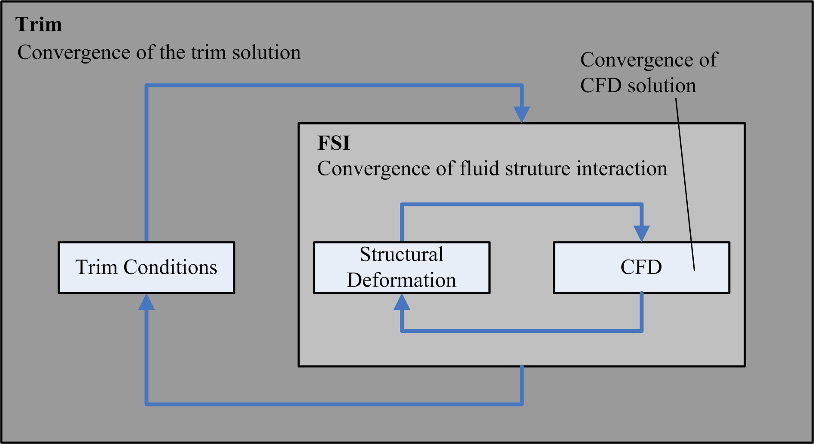
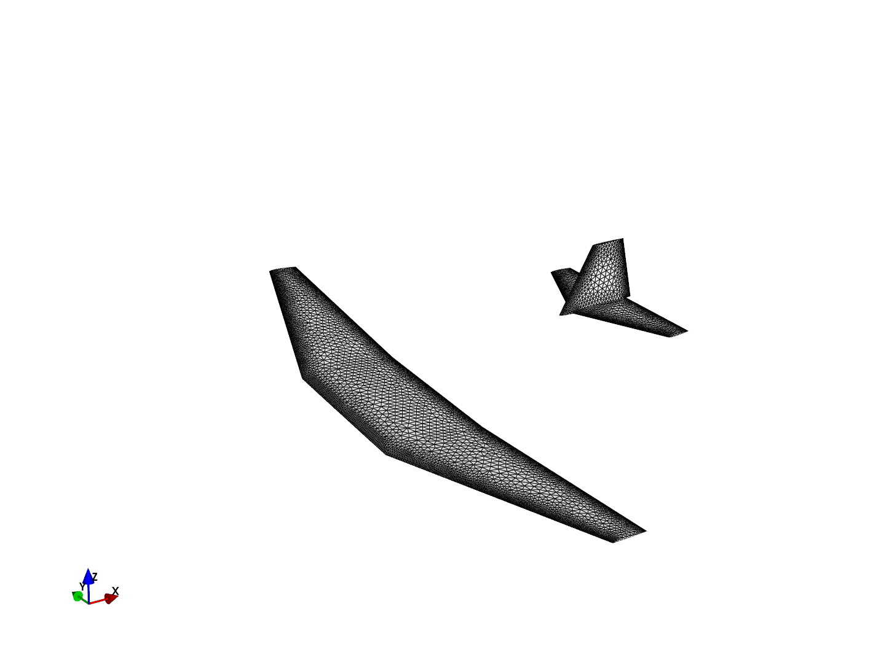
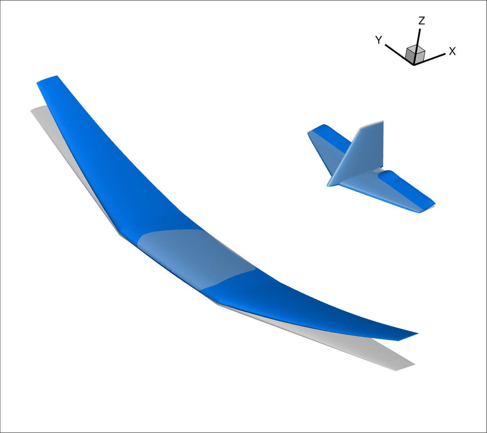
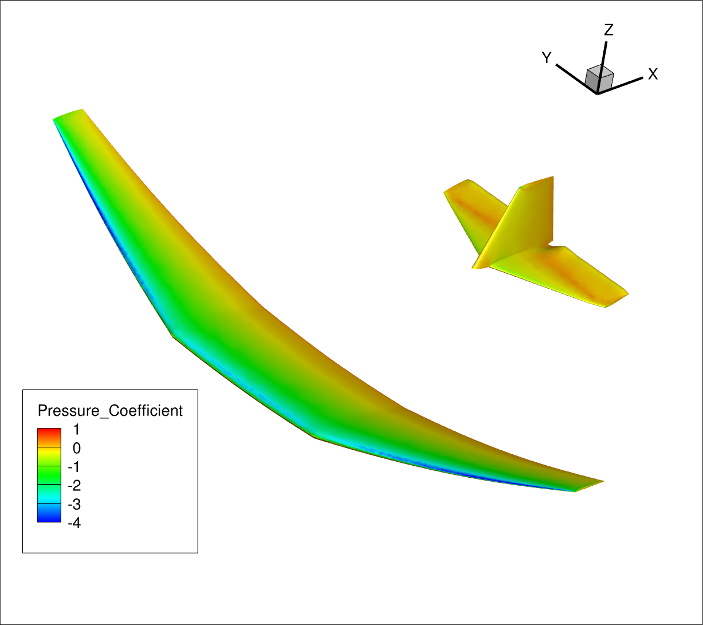

# Maneuver Loads with CFD
This section describes the use of the interface with the CFD solver [SU2](https://su2code.github.io/) for maneuver loads calculation. Because this is an advanced topic, please make sure that you are familiar with both Loads Kernel and SU2.

## General Ideas
Next to the aerodynamic panel methods, CFD solvers offer an additional source for aerodynamic forces. The direct coupling of Loads Kernel with a CFD solver (steady and unsteady solutions) is not very complicated and more an implementation / interface question. The advantages are that all aerodynamic non-linearities are captured (as good as the CFD solution is) and included in the loads analysis. Areas of application include:
* Transonic operational points (most transport aircraft)
* Vortex dominated flows (many military aircraft)
* Maneuvers and gusts where flow separation occurs
* Volumetric bodies (panel methods and fuselages are no friends)

Key requirements for a CFD solver for loads and aeroelasticity purposes are:
* Steady and unsteady solutions
* Volume mesh deformation
* 1-cosine gust, e.g. via a field velocity approach
* Python interface
*  Robustness & fast time to solution

## Interface with SU2
The primary data exchange with SU2 (forces on the CFD surface, elastic deformations and rigid body motion) happens in-memory via the Python interface. In addition, a configuration file (.cfg) with the baseline parameters of the CFD solver is necessary. To complete the baseline parameters, Loads Kernel adds trimcase-depended parameters that describe the current operational point and then initializes SU2 with the updated parameter file (para_subcase_*). A file output of the surface or volume solution is not necessary but helps with visualization or to diagnose problems.

The CFD surface deformations are calculated by Loads Kernel and include the elastic deformations as well as control surface deflections. They are calculated on the underlying structural grid and on the aerodynamic panel mesh respectively and interpolated on the CFD mesh using radial basis functions. SU2 is then asked to perform the volume mesh deformation. For maneuver loads, the rigid body motion is imposed using a field velocity approach, meaning the Mach number of the farfield is set to zero.

> Next to maneuver loads, Loads Kernel's current SU2 interface also allows for a gust encounter and the computation of linearized CFD forces (experimental), which can be used for frequency domain analyses.

Remember that the CFD solution is an iterative process and a compromise between numerical accuracy and speed. In the context of a trim solution, CFD is the most inner loop as illustrated below. The cauchy convergence criterion has proven to be a good means to establish a converged CFD solution.



*Sketch of iterative trim solution scheme.*

## Prerequisites
SU2 needs to be compiled with the Python wrapper and with MPI. If you can import SU2 in Python, this is a good sign.
```
import SU2
import pysu2
```
Also make sure that the correct MPI is used, all paths are set, etc.

## Tutorial
A light-weight, inviscid Euler mesh with 440k nodes is available on request (due to file size) for the purpose of this tutorial. Like the aerodynamic panel model, it comprises the main wings and the empennage, as shown below. 



*Euler CFD mesh with 440k nodes for the DC3.*

A file with some baseline parameters for SU2 can be found in the folder tutorials -> DC3_model -> cfd. Note that those parameters are tuned for demonstration + speed and might need to be changed for different models and/or aircraft. In addition to the Euler solution, SU2 has been tested by the author with RANS, requiring no changes on the Loads Kernel side and only a different set of baseline parameters plus a different mesh. Because the CFD-based solution sequences are implemented on top of the classical, panel-based solutions, only the following items are added to an existing JCL. As an example, a JCL named ‘jcl_dc3_cfd_euler.py’ and can be found in the folder tutorials -> DC3_model -> JCLs.

First, the CFD solution is selected in the 'aero' section. As CFD solvers typically create a large number of files, it is convenient to use in a dedicated folder 'cfd_root' where all CFD-related files are kept.
```
cfd_root = '/path/to/CFD/files/'

# Settings for the aerodynamic model
self.aero = {'method': 'cfd_steady',
             # Additional parameters for CFD
             'para_path': cfd_root,
             'para_file': 'baseline_euler.cfg',
             # Currently implemented interfaces: 'tau' or 'su2'
             'cfd_solver': 'su2',
             }
```
Next, Loads Kernel needs to be aware of the CFD mesh and the surface markers used for surface deformation.
```
# General CFD surface mesh information
self.meshdefo = {'surface': {'fileformat': 'su2',  # implemented file formats: 'cgns', 'netcdf', 'su2'
                             # file name of the CFD mesh
                             'filename_grid': os.path.join(cfd_root, 'CFD_mesh_440kNodes.su2'),
                             # list of markers [1, 2, ...] or ['upper', 'lower', ...] of surfaces to be included in
                             # deformation
                             'markers': ['wing_upper', 'wing_lower', 'wing_te', 'wing_tips', 'ht', 'vt'],
                            },
                }
```

Start by running the preprocessing single-threaded and check/inspect the model.
```
from loadskernel import program_flow

# Here you launch the Loads Kernel with your job
k = program_flow.Kernel('jcl_dc3_cfd_euler', pre=True, main=False, post=False,
                        path_input='/path/to/JCLs',
                        path_output='/path/to/output')
k.run()
```
If the model looks fine, proceed with running the mainprocessing in parallel using MPI. Modify the launch.py to use the ClusterMode and with i being the trim case, e.g. i=0 for the first case. This facilitates operation on a high performance cluster with a job scheduler, leverage the job queening system to handle the trimcases (one job = one trimcase). Working only on your local system, you might use 'for i in range(0, n)' or similar to run all trimcases sequentially.

```
from loadskernel import program_flow

# Here you launch the Loads Kernel with your job
c = program_flow.ClusterMode('jcl_dc3_cfd_euler', pre=False, main=True, post=False,
                             path_input='/path/to/JCLs',
                             path_output='/path/to/output')
c.run_cluster(i=0)

#for i in range(0, n):
#    c.run_cluster(i)
```
Then use mpiexec to essentially launch Loads Kernel four times (or more) with MPI. Both Loads Kernel and SU2, launched from within Loads Kernel, should detect MPI and behave accordingly.
```
mpiexec -np 4 python launch.py
```

The cluster mode creates one response per job/trimcase and allows to gather all responses, creating one unified HDF5 file, so that the postprocessing and the GUIs should work as normal.
```
c.gather_responses()
```

The pictures below show the deformed CFD surface (blue) and the surface pressure coefficient for a pullup maneuver with Nz = 2.5, corresponding to subcase 3 in the example.



*CFD surface deformation, pullup maneuver with Nz = 2.5.*



*Surface pressure coefficient cp, pullup maneuver with Nz = 2.5.*
